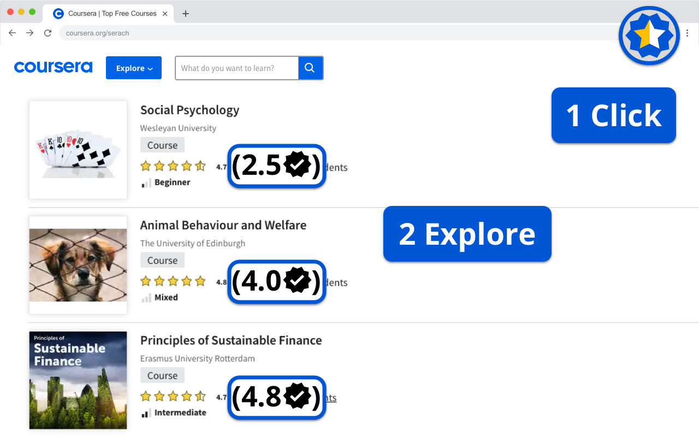
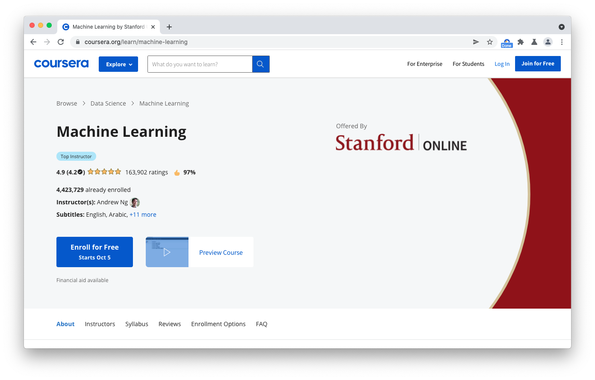

#  Coursera Advisor

Coursera Advisor is a no nonsense Chrome extension that uses the reviews of other students to give a more accurate rating to the course, to save you time and money.

If you have been browsing Coursera maybe you have thought `WOW! All courses have between 4.5 and 4.9 stars`, and they really do, but not all courses are that great, that's where Coursera Advisor comes in, with a single click you will know if the course is worth your time and effort, just check the new rating in parentheses with the  to the left of the Coursera original score.

You can use it anywhere where you see ⭐ star ratings ⭐ in Coursera,
is just as easy as one click to decide if a course is worth for you,

one click to explore all the options from an overwhelming results page

### In summary, you can use it in:
#### In a course

#### In a SEARCH!

#### In an specialization

#### it will even review all the courses in one go

